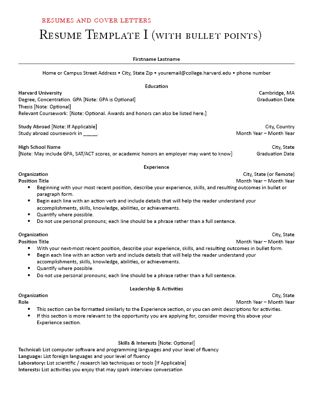

#Frontend technical specifications

- Create a static website that serves an HTML resume.

##Resume formats

Going to use the Harvard Resume Template format for the basis of my resume.

###Resume format generation

Prompt to ChatGPT 5:

'''text
Convert this resume format .png to HTML format
Please do not use CSS framework.
Please use the least amount of CSS tags
'''
Image provided.

This is the generated output:
